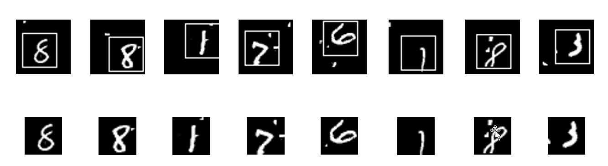
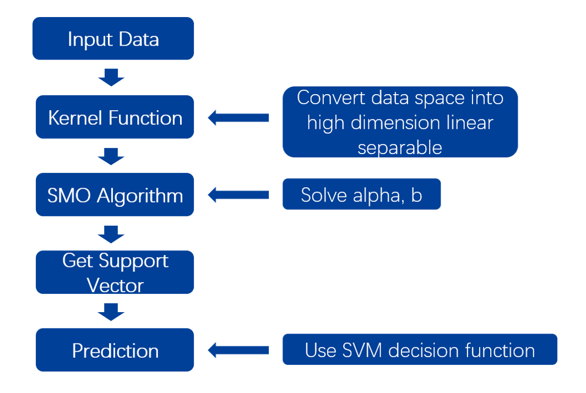
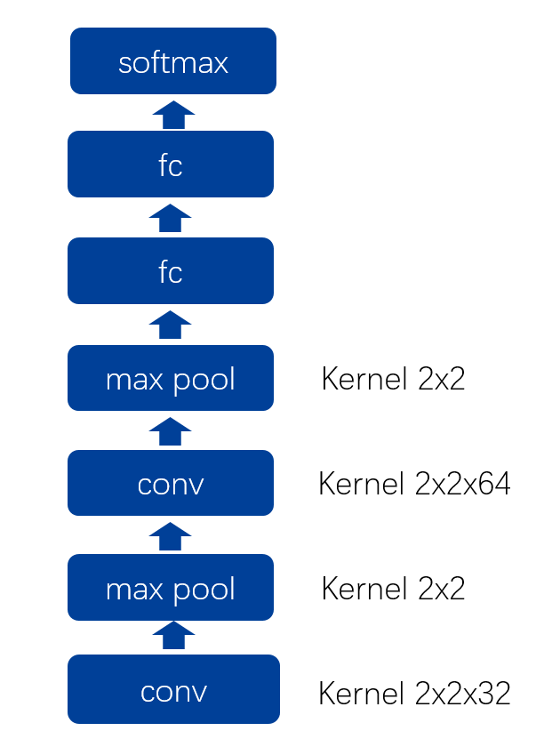
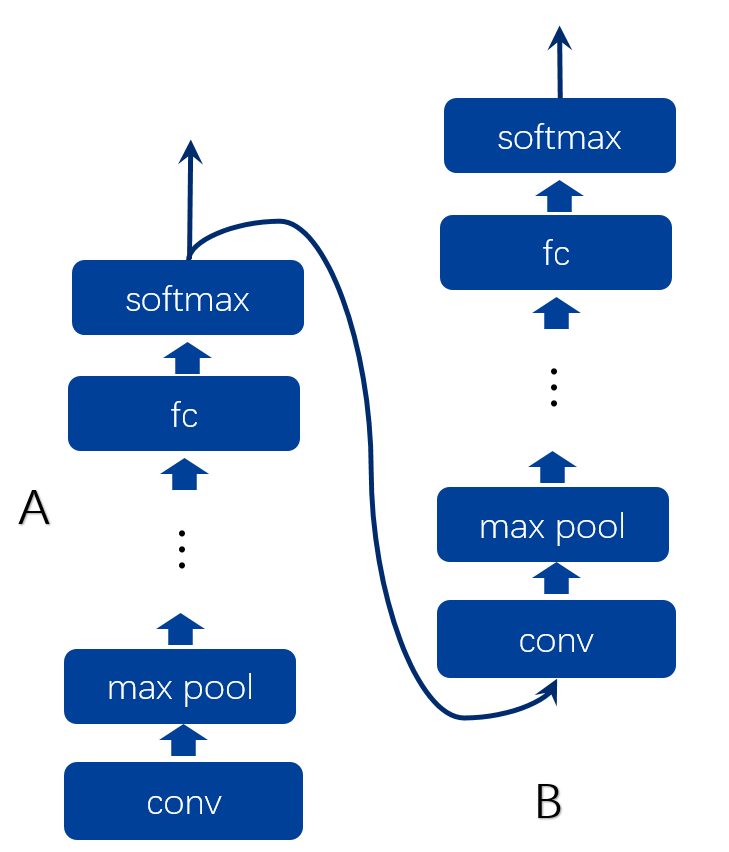
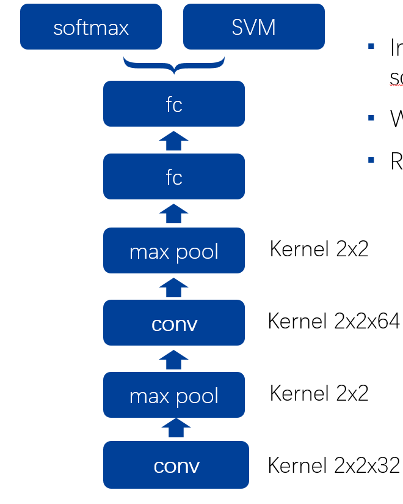
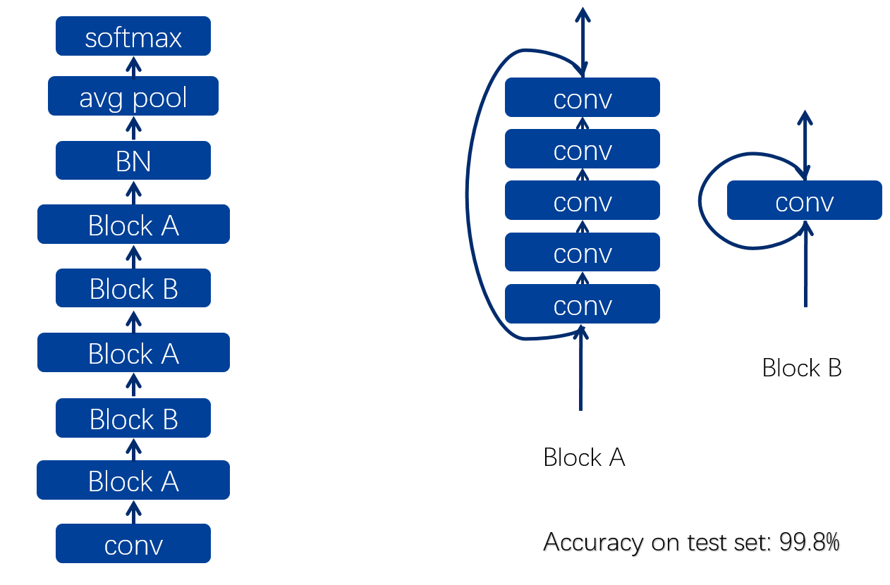
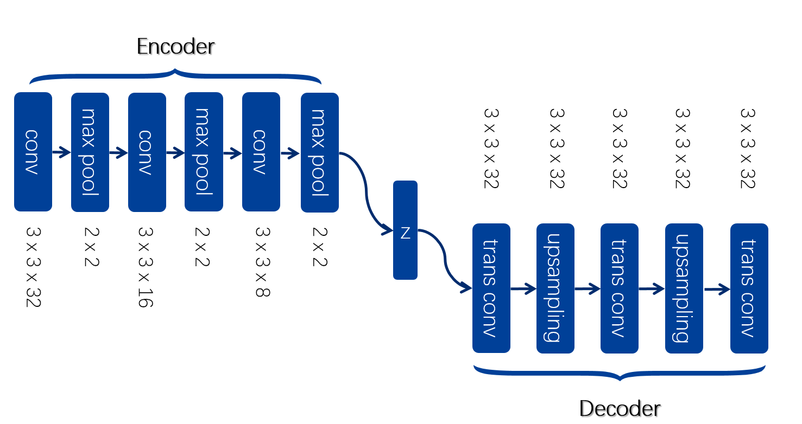
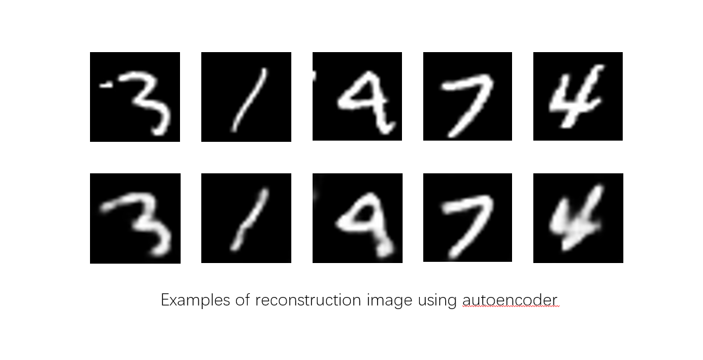
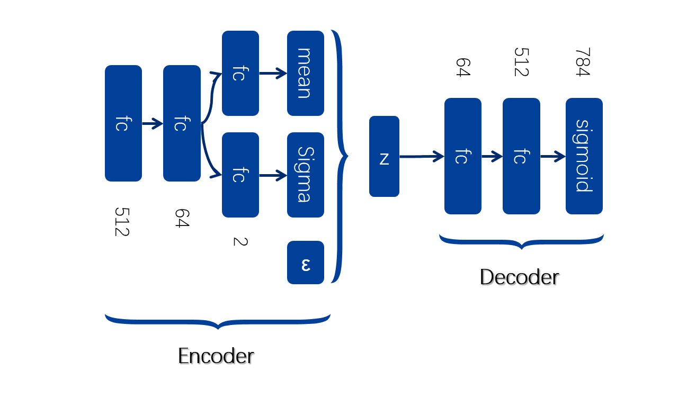
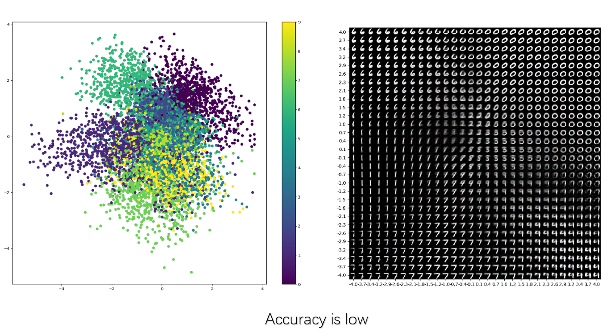

# CS420 Machine Learning Final Homework

## Introduction
In this project, we build differernt model to cope with hand-written digit recognition task.  Machine learning models like SVM, CNN, ResNet, autoencoder and VAE are used.
## Preprocessing

- Centered(find the center of white pixels and shift it to the center)
- Crop image to 28x28 (784 << 2025) (will drop many useless blocks)

## Data Set
You can download the dataset by click the data set name.  

|Name                                       | Train Size| Test Size | Image Size| Diff|
|:--:                                           |:--:      |:--:            |:--:  |:--:|
|[origin](http://cmach.sjtu.edu.cn/course/cs420/projects/mnist.zip)| 60000| 10000| 45| original data|
|[crop](https://jbox.sjtu.edu.cn/l/XH2s6l)|60000|10000|28| crop from origin|
|[crop2](https://jbox.sjtu.edu.cn/l/5odWvO)|60000|10000|14|2\*2 upsampling from crop|
|[low_conf](https://jbox.sjtu.edu.cn/l/MoZdMp)|15000|10000|28|images with lowest 15000 conidence from model 14.0.0 based on crop|
|[rotate](https://jbox.sjtu.edu.cn/l/MoZdMW)|180000|10000|28|rotate images(45 and 135) based on crop|
|[fc2](https://jbox.sjtu.edu.cn/l/dn1hhw)|60000|10000|64|fc2 output based on crop|

## Method
### SVM
Kernel = rbf  
Only prforms well in crop2

### CNN

### Residual Network

### Autoencoder

### VAE

## Performaence
### SVM
|Paramaters| Train Data Set | Performance(Test)|
|:--:      |:--:            |:--:              |
|kernel='rbf'| origin| not converge|
|kernel='linear'| origin| not converge|
|kernel='rbf'| crop| not converge|
|kernel='rbf'| crop2| 92.62%|

### CNN
|Paramaters| Train Data Set | Performance(Test)|
|:--:      |:--:            |:--:              |
|2 convolution, pooling and fc layers| origin| 96.5%|
|2 convolution, pooling and fc layers| crop| 98.25%|
|connect to  SVM| crop| 98.27%|
|2 CNN models| crop| 97.75%|

### Residual Network
|Paramaters| Train Data Set | Performance(Test)|
|:--:      |:--:            |:--:              |
|batch size = 500, epoch = 200| origin| 99.8%|

### Autoencoder and VAE
|Method| Train Data Set | Performance(Test)|
|:--:      |:--:            |:--:              |
|Autoencoder| crop| 95.28%|
|VAE| crop| 94.25%|
